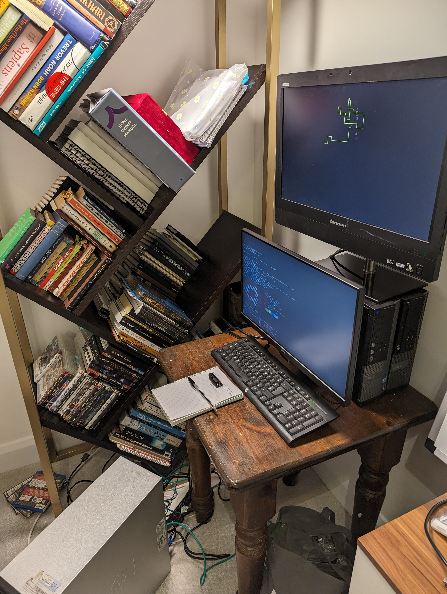

# HomeLab Part 2

## Backstory

My homelab has been shelved for a few months. It is currently made of mostly decomissioned office machinery I found for cheap or free nearby, as Raspberry Pi machines were in short supply over Covid. 

The recent energy price bump made it uneconomical to run 1000W of compute 24/7. However, recently I moved to another location that only uses electric heaters. This meant that during winter it makes sense to run these computers simply as heaters and use the compute for my projects. 

## The Goal

I have recently encountered an interesting project that is hosted in OpenStack. I would like to set something like that up, where I can also requisition a Kubernetes cluster and use it to practice on.

## Initial Set Up

### The compute that is available

| Make/Model | Name   | Processor | Memory | Storage |
|------------|--------|-----------|--------|---------|
| Lenovo ThinkCentre| Eirwen | i5-3470 @ 3.7 GHz | 12GB | 120GB |
| Dell Optiplex 7010 | Nevan  | i5-3470@3.2GHz | 8GB | 120GB |
| Dell Optiplex 3010 | Lestat | i5-3470@3.6GHz | 6GB | 120GB |
| HP Z400 | Agnes  | Intel Xeon W3565@3.2GHz | 18GB | 250GB |

It is a ragtag group of servers I will be using for the moment.

### OS and setup

All these machines have been set at the default settings for **Ubuntu 22.04**, with the exception of using all the storage space. They sit behind a **Ubiquity EdgeSwitch5XP** that is then directly wired into my home router. Not a perfect solution that I would like to correct in the future. I also lack a KVM, and am simply using a VGA cable plugged into a monitor and a keyboard. 

The entire set up is pictured below. 





I don't often encounter networking problems at my work so I it took me sometime to configure and generate an appropriate netplan. The current configuration is as follows:

```
network:
  version: 2
  renderer: NetworkManager
  ethernets:
    eno1:
      dhcp4: no
      addresses: [XXX.XXX.XXX.XXX/32]
      routes:
        - to: default
          via: XXX.XXX.XXX.XXX
      nameservers:
        addresses: [8.8.8.8,8.8.4.4]
```

I have a feeling the /32 CIDR block might be too small for the intended use. I will modify it later as the requirements change. I image a lot of bridging might happen.

In order to operate it well, I also have an Ubuntu 22.04 VM, that I am running through a Windows 10 machine and VMWare. This gives me the ability to fully install compenents I might need, such as Ansible.

### Setting up Ansible

I have created unique and random names for the purposes of remote administration. 

I have also edited the `/etc/hosts` file of my dev machine to keep the IP addresses of my local machines.

To add another layer of security I also used an SSH agent to pass my keys across to each individual machine. 

I also have a folder set up called Ansible that at the start simply stores this list of machines.

I manage to register all the servers using Ansible, and test the autnetication works well.

`$ ansible group1 -m ping`

Which Results in:

```
n1e5a@eirwen | SUCCESS => {
    "ansible_facts": {
        "discovered_interpreter_python": "/usr/bin/python3"
    },
    "changed": false,
    "ping": "pong"
}
j3cfs@nevan | SUCCESS => {
    "ansible_facts": {
        "discovered_interpreter_python": "/usr/bin/python3"
    },
    "changed": false,
    "ping": "pong"
}
b1d3c@lestat | SUCCESS => {
    "ansible_facts": {
        "discovered_interpreter_python": "/usr/bin/python3"
    },
    "changed": false,
    "ping": "pong"
}
x2950@agnes | SUCCESS => {
    "ansible_facts": {
        "discovered_interpreter_python": "/usr/bin/python3"
    },
    "changed": false,
    "ping": "pong"
}
```

So I now have a central administration into the cluster. My next step is to try and get OpenStack on my machines. I would first like to get some hands on experience and figure out how these components work.

### Dry Run

I am using SunBeam and Juju to deploy [Microstack](https://microstack.run/) simply on Agnes, to get some hands on experience and get some insight into the architecture. 