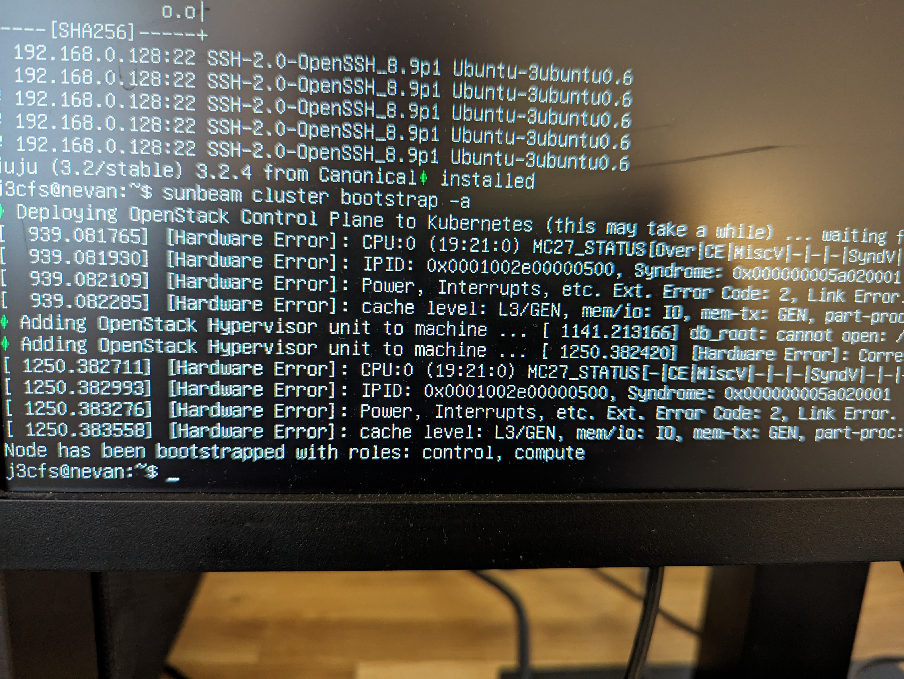

# HomeLab Part 2

## Backstory

My homelab has been shelved for a few months. It is currently made of mostly decomissioned office machinery I found for cheap or free nearby, as Raspberry Pi machines were in short supply over Covid. 

The recent energy price bump made it uneconomical to run 1000W of compute 24/7. However, recently I moved to another location that only uses electric heaters. This meant that during winter it makes sense to run these computers simply as heaters and use the compute for my projects. 

## The Goal

I have recently encountered an interesting project that is hosted in OpenStack. I would like to set something like that up, where I can also requisition a Kubernetes cluster and use it to practice on.

## Initial Set Up

### The compute that is available

| Make/Model | Name   | Processor | Memory | Storage |
|------------|--------|-----------|--------|---------|
| Lenovo ThinkCentre| Eirwen | i5-3470 @ 3.7 GHz | 12GB | 120GB |
| Dell Optiplex 7010 | Nevan  | i5-3470@3.2GHz | 8GB | 120GB |
| Dell Optiplex 3010 | Lestat | i5-3470@3.6GHz | 6GB | 120GB |
| HP Z400 | Agnes  | Intel Xeon W3565@3.2GHz | 18GB | 250GB |

It is a ragtag group of servers I will be using for the moment.

### OS and setup

All these machines have been set at the default settings for **Ubuntu 22.04**, with the exception of using all the storage space. They sit behind a **Ubiquity EdgeSwitch5XP** that is then directly wired into my home router. Not a perfect solution that I would like to correct in the future. I also lack a KVM, and am simply using a VGA cable plugged into a monitor and a keyboard. 

The entire set up is pictured below. 


I don't often encounter networking problems at my work so I it took me sometime to configure and generate an appropriate netplan. The current configuration is as follows:

```
network:
  version: 2
  renderer: NetworkManager
  ethernets:
    eno1:
      dhcp4: no
      addresses: [XXX.XXX.XXX.XXX/32]
      routes:
        - to: default
          via: XXX.XXX.XXX.XXX
      nameservers:
        addresses: [8.8.8.8,8.8.4.4]
```

I have a feeling the /32 CIDR block might be too small for the intended use. I will modify it later as the requirements change. I image a lot of bridging might happen.

In order to operate it well, I also have an Ubuntu 22.04 VM, that I am running through a Windows 10 machine and VMWare. This gives me the ability to fully install compenents I might need, such as Ansible.

### Setting up Ansible

I have created unique and random names for the purposes of remote administration. 

I have also edited the `/etc/hosts` file of my dev machine to keep the IP addresses of my local machines.

To add another layer of security I also used an SSH agent to pass my keys across to each individual machine. 

I also have a folder set up called Ansible that at the start simply stores this list of machines.

I manage to register all the servers using Ansible, and test the autnetication works well.

`$ ansible group1 -m ping`

Which Results in:

```
n1e5a@eirwen | SUCCESS => {
    "ansible_facts": {
        "discovered_interpreter_python": "/usr/bin/python3"
    },
    "changed": false,
    "ping": "pong"
}
j3cfs@nevan | SUCCESS => {
    "ansible_facts": {
        "discovered_interpreter_python": "/usr/bin/python3"
    },
    "changed": false,
    "ping": "pong"
}
b1d3c@lestat | SUCCESS => {
    "ansible_facts": {
        "discovered_interpreter_python": "/usr/bin/python3"
    },
    "changed": false,
    "ping": "pong"
}
x2950@agnes | SUCCESS => {
    "ansible_facts": {
        "discovered_interpreter_python": "/usr/bin/python3"
    },
    "changed": false,
    "ping": "pong"
}
```

So I now have a central administration into the cluster. My next step is to try and get OpenStack on my machines. I would first like to get some hands on experience and figure out how these components work.

### Dry Run

I am using SunBeam and Juju to deploy [Microstack](https://microstack.run/) simply on Agnes, to get some hands on experience and get some insight into the architecture. 

Following the instructions I installed openstack: 

`sudo snap install openstack --channel 2023.1`

Then I ran the prep scripts and assingned them a group:

`sunbeam prepare-node-script | bash -x && newgrp snap_daemon`


This immedetly ran into errors, and mostly because as I suspected I would need a much bigger CIDR block. I quickly used netplan to give each machine a `/24` CIDR block. This is a less than elegant solution because I assume now there would be clashes but I was working fast trying to get to some kind of Minimum Viable Product.

I used `ip a` to show me my networking devices and now there is quite a few of them! 

```
1: lo: <LOOPBACK,UP,LOWER_UP> mtu 65536 qdisc noqueue state UNKNOWN group default qlen 1000
    link/loopback 00:00:00:00:00:00 brd 00:00:00:00:00:00
    inet 127.0.0.1/8 scope host lo
       valid_lft forever preferred_lft forever
    inet6 ::1/128 scope host 
       valid_lft forever preferred_lft forever
2: enp38s0: <BROADCAST,MULTICAST,UP,LOWER_UP> mtu 1500 qdisc fq_codel state UP group default qlen 1000
    link/ether 2c:f0:5d:a8:b4:9c brd ff:ff:ff:ff:ff:ff
    inet 192.168.0.128/24 brd 192.168.0.255 scope global dynamic noprefixroute enp38s0
       valid_lft 51785sec preferred_lft 51785sec
    inet6 fe80::dec1:d897:6d0b:15a8/64 scope link noprefixroute 
       valid_lft forever preferred_lft forever
3: wlo1: <NO-CARRIER,BROADCAST,MULTICAST,UP> mtu 1500 qdisc noqueue state DOWN group default qlen 1000
    link/ether 3c:9c:0f:8a:0c:6e brd ff:ff:ff:ff:ff:ff
    altname wlp40s0
7: cali5ae0e55f9d1@if3: <BROADCAST,MULTICAST,UP,LOWER_UP> mtu 1450 qdisc noqueue state UP group default 
    link/ether ee:ee:ee:ee:ee:ee brd ff:ff:ff:ff:ff:ff link-netns cni-7241753c-9bca-171d-283b-ca88fa0fad83
    inet6 fe80::ecee:eeff:feee:eeee/64 scope link 
       valid_lft forever preferred_lft forever
...

55: vxlan.calico: <BROADCAST,MULTICAST,UP,LOWER_UP> mtu 1450 qdisc noqueue state UNKNOWN group default 
    link/ether 34:37:f9:37:e0:76 brd ff:ff:ff:ff:ff:ff
    inet 10.1.68.128/32 scope global vxlan.calico
       valid_lft forever preferred_lft forever
    inet6 fe80::6437:f9ff:fe37:e076/64 scope link 
       valid_lft forever preferred_lft forever

```


I attempted to bootstrap the server: 

`sunbeam cluster bootstrap --accept-defaults`

And the result looked something along the lines of this:
```
Deploying OpenStack Control Plane to Kubernetes (this may take a while) ... waiting for services to come online (20/23)
```
This caused some confusion. I then looked at htop for the server. 


The server was overheating and trottling down and then speeding up and overheating again. This may relegate this affordible cluster to not running OpenStack at all.

#### Hardware Shenanigans

I initially selected Agnes because this server covered the minimum requirements on the official website. This means I needed to find a PC to work with that could handle the load. And I don't really own any enterprise hardware. The closest I have was my Windows machine I built sometime ago. 

Given I didn't want to uninstall my host OS. I quickly transplanted my OS drive from my laptop to my computer. 


Now that didn't work either, my laptop was running on PopOs, and whilst that is based on Ubuntu, the tool did not work. I am chalking that one up to Canonical. I didn't want to reinstall my laptop either. So I disassembled Nevan, as it had a SSD drive. 


And then I reattached it to my own computer. 


Where the tool actually worked! 



Unfortunately, I didn't have a Desktop Environment and a Window Manager installed so I could not access the GUI. Therefore my next job was to get that running. 

`sudo apt install ubuntu-mate-desktop -y`

Installed my desired desktop environment. This allowed me to get back into things.

#### Getting to the GUI


To get to the GUI I need to get credetials that are generated by the Keystone project. This is actually a small and efficient LDAP server. 

Sunbeam is an effective way of getting an account.

`sunbeam configure --accept-defaults --openrc demo-openrc`

This results in a file being generated in your current directoring. Looking into the demo-openrc file you get to see:

```
# openrc for demo
export OS_AUTH_URL=http://10.20.21.12/openstack-keystone
export OS_USERNAME=demo
export OS_PASSWORD=ABCDEFGH!"£%123
export OS_USER_DOMAIN_NAME=users
export OS_PROJECT_DOMAIN_NAME=users
export OS_PROJECT_NAME=demo
export OS_AUTH_VERSION=3
export OS_IDENTITY_API_VERSION=3
```

To use the credentials you simple use `source demo-openrc`.

You know, it is surprising how many similarities this has to the last project I worked on which was [ForgeOps](https://github.com/ForgeRock/forgeops). 

Once you get the account you can use the interface again to generate a local url. 

`sunbeam dashboard-url`

The output is as follows:

`http://10.20.21.12:80/openstack-horizon`

Which gives me access to the horizon dashboard. 

The credentials for which are inside of `demo-openrc` file. And we can enter them into the dashboard. 


If I have done everything right, I should see the Horizon interface.


#### Testing Functionality


To test wether Openstack works well I will try and initialise one VM instance. 

I will do this via the CLI: 

`sunbeam launch ubuntu --name test`

Resulting in: 

```
Launching an OpenStack instance ... 
Access instance with `ssh -i /home/j3cfs/snap/openstack/324/sunbeam 
ubuntu@10.20.20.56`

```

Its creation can then be verified via the GUI. 


This confirms that I now have a working environment. Given that I now have a way to experiment it would be prudent to learn how to administrate an OpenStack cluster. 

### Learning to adminstrate

